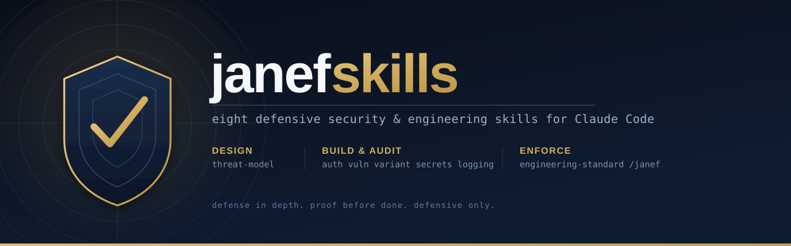

<p align="center">
  
</p>

<p align="center">
  
  
  
  
  
  
  <br>
  
  
</p>

<h1 align="center">JANEF Forge</h1>

<p align="center">
  <strong>Engineering discipline for AI coding agents.</strong><br>
  Forge better code. Prove every change.
</p>

---

JANEF Forge gives a coding agent one short engineering contract, a deterministic router, and 24 focused engineering and defensive-security capabilities that load only when a task needs them. It replaces three earlier projects, janefskills, Agent Engineering Stack, and LeanCode Engineer, with one architecture, one router, and one quality gate.

- **One contract, stated once.** Twelve invariants in `core/protocol/contract.md`, rendered into the entry skill and host policy fragments; validation fails if a copy drifts.
- **Metadata-first routing.** Every capability declares triggers, negative triggers, risk, dependencies, conflicts, and the responsibilities it owns. The router selects the minimum sufficient set and explains why.
- **Explicit composition.** Required dependencies are always pulled in (UI work always brings accessibility; a security pass always brings variant hunting); conflicts are rejected; profile caps bound context.
- **Risk-based verification.** Low, medium, high, critical; each tier names the evidence a completion claim needs. High and critical work escalates to the high-assurance profile automatically.
- **Measured context.** Estimated structural context cost per task (≈2.1k tokens for a README fix, ≈5.5k for a tenant API change, versus ≈32k to load everything), with regression gates in CI. Never a billing claim.
- **Untrusted by default.** External skills, plugins, hooks, and MCP packages go through `skill-security-audit` and a static triage that never executes candidate code.

## Quick start

Claude Code (marketplace):

```text
/plugin marketplace add AL-JANEF/janefskills
/plugin install janefskills@janefskills
```

Then start any substantive task with `/forge <task>`, or `/forge lean <task>` / `/forge high-assurance <task>` to pick a profile. `/forge security pass` runs the audit-grade multi-layer security review. The old `/janef` still works as a deprecated alias.

Personal install (Claude Code and Codex):

```bash
python3 scripts/install.py install --target both --dry-run
python3 scripts/install.py install --target both
python3 scripts/install.py policy --target claude      # optional always-on policy block
python3 scripts/install.py doctor
```

The installer never overwrites silently, backs up anything it replaces, records what it owns, and uninstalls only that (`install.py uninstall`).

## What routing looks like

```text
$ python3 scripts/forge.py explain "Add a tenant-scoped API endpoint that exports billing history"
profile:  standard -> high-assurance
risk:     critical  (critical:billing, high:authorization, medium:api, medium:endpoint)
selected:
  - api-contracts              score 2
  - auth-hardening             score 1
  - vuln-audit                 score 1
  - testing-verification       required by profile:high-assurance
  - review-defect-first        required by profile:high-assurance
  - variant-hunt               required by profile:high-assurance
verification tier: critical
context:  ~8k est. tokens; skipped 18 capabilities
```

```text
$ python3 scripts/forge.py explain "Fix the typo in the README"
profile:  standard   risk: low
selected:
  - documentation-integrity    score 1
context:  2078 est. tokens (core 1656 + skills 422); skipped 23 capabilities
```

## Capabilities

| Domain | Capabilities |
|---|---|
| Core | `forge` (entry point, contract, router) |
| Engineering | `implementation-quality` · `root-cause-debugging` · `architecture-integrity` · `testing-verification` · `api-contracts` · `database-integrity` · `performance-scalability` · `devops-reliability` · `git-discipline` · `documentation-integrity` · `frontend-design-quality` · `ui-ux-quality` · `accessibility-quality` · `context-efficiency` · `review-defect-first` · `delegation-discipline` |
| Security | `threat-model` · `auth-hardening` · `vuln-audit` · `variant-hunt` · `secrets-guard` · `security-logging` · `security-audit` · `skill-security-audit` |

Every security capability is defensive only: it hardens, audits, and verifies; it never attacks or bypasses. `python3 scripts/forge.py list` prints the registry with risk levels and dependencies.

## Profiles

| Profile | For | Cap | Verification | Review |
|---|---|---|---|---|
| `lean` | well-understood, focused changes | 2 skills, 1 reference | risk-based from low | none |
| `standard` (default) | production engineering | 4 skills | risk-based, escalates at high risk | at high risk |
| `high-assurance` | auth, permissions, migrations, production, critical data, infrastructure | 5 skills | floor high; critical adds real-DB verification, mutation check, rollback | always |

## Developer tooling

```bash
python3 scripts/forge.py validate            # manifests, registry graph, packaging, budgets, links, contract sync
python3 scripts/forge.py list                # capabilities, profiles, aliases
python3 scripts/forge.py find "<task>"       # selected capabilities
python3 scripts/forge.py explain "<task>"    # selection trace, risk, verification tier, context estimate
python3 scripts/forge.py context "<task>"    # estimated structural context cost and skipped capabilities
python3 scripts/forge.py doctor              # repository and installation integrity
python3 scripts/quality_gate.py              # the one canonical pre-release command
```

Standard library only; no dependencies to install.

## Documentation

- [Architecture](./docs/architecture/JANEF_FORGE_ARCHITECTURE.md): product boundary, taxonomy, invariants, registry, routing, composition, profiles, verification, context, adapters, security, extension.
- [Convergence matrix](./docs/architecture/CONVERGENCE_MATRIX.md): every source skill, module, and script and what became of it.
- [Compatibility](./docs/compatibility.md) · [Migration to 2.0](./docs/migration-v2.md) · [Releasing](./docs/releasing.md) · [Changelog](./CHANGELOG.md) · [Security policy](./SECURITY.md) · [Notice and provenance](./NOTICE.md)

## Relationship to JANEF ONE

Forge is the capability and engineering-discipline layer. [JANEF ONE](https://github.com/AL-JANEF/janef-one) is a separate orchestration and control-plane product (WorkGraph, persistent state, scheduling, authorization). Forge does not reproduce or depend on it.

## Contributing

Issues and pull requests are welcome; see [CONTRIBUTING.md](./CONTRIBUTING.md). Security capabilities must stay strictly defensive.

## Built by a practitioner

Forge comes out of production work by [ALJANEF](https://github.com/AL-JANEF), a solo founder building AI-native ventures for Gulf markets, and holds coding agents to the same evidence-before-done standard those systems are built under.

## License

[MIT](./LICENSE) © 2026 ALJANEF. Source attributions in [NOTICE.md](./NOTICE.md).
